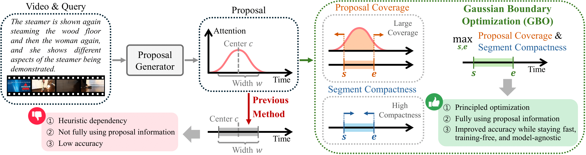

# Official Implementation for Gaussian Boundary Optimization

This repository contains the source code and visualization results associated with our paper on Gaussian Boundary Optimization (GBO) for weakly supervised video grounding.



Weakly supervised temporal video grounding aims to localize query-relevant segments in untrimmed videos using only video-sentence pairs, without requiring ground-truth segment annotations that specify exact temporal boundaries. Recent approaches tackle this task by utilizing Gaussian-based temporal proposals to represent query-relevant segments. However, their inference strategies rely on heuristic mappings from Gaussian parameters to segment boundaries, resulting in suboptimal localization performance. To address this issue, we propose Gaussian Boundary Optimization (GBO), a novel inference framework that predicts segment boundaries by solving a principled optimization problem that balances proposal coverage and segment compactness. We derive a closed-form solution for this problem and rigorously analyze the optimality conditions under varying penalty regimes. Beyond its theoretical foundations, GBO offers several practical advantages: it is training-free and compatible with both single-Gaussian and mixture-based proposal architectures. Our experiments show that GBO significantly improves localization, achieving state-of-the-art results across standard benchmarks. Extensive experiments demonstrate the efficiency and generalizability of GBO across various proposal schemes.


## Dependencies
- cuda 12.1
- python 3.8
- pytorch 2.0
- nltk
- wandb
- h5py
- fairseq

## Folder Structure

- `gbocnm/`, `gbocpl/`, `gbopps/`  
  Each folder corresponds to a model (**[CNM](https://github.com/minghangz/cnm)**, **[CPL](https://github.com/minghangz/cpl)**, **[PPS](https://github.com/sunoh-kim/pps)**) integrated with GBO.  
  The `train.py` script in each GBO folder is the main entry point for running the corresponding model with GBO inference.  
  You can easily run experiments by executing `eval_gio.sh` in the `script` folder of each GBO folder.  
  **Checkpoints for each model should be downloaded directly from their respective repositories linked above, and should be placed inside the `checkpoint/` folder of each corresponding GBO folder** (e.g., `gbocnm/checkpoint/`, `gbocpl/checkpoint/`, `gbopps/checkpoint/`).

## Example Commands
To run the experiment for the PPS model:
```
cd gbopps/script
bash eval_gio.sh
```

Similarly, you can execute the following for other models:

```
cd gbocpl/script
bash eval_gio.sh
```
```
cd gbocnm/script
bash eval_gio.sh
```

## Visualization

The `fig_data_*.png` files contain performance curves for different models (CNM, CPL, PPS) and datasets (ActivityNet Captions, Charades-STA), evaluated at Rank@1 and Rank@5 under various IoU metrics.


## Acknowledgement
The following repositories were helpful for our implementation.

https://github.com/sunoh-kim/pps

https://github.com/minghangz/cpl

https://github.com/minghangz/cnm


